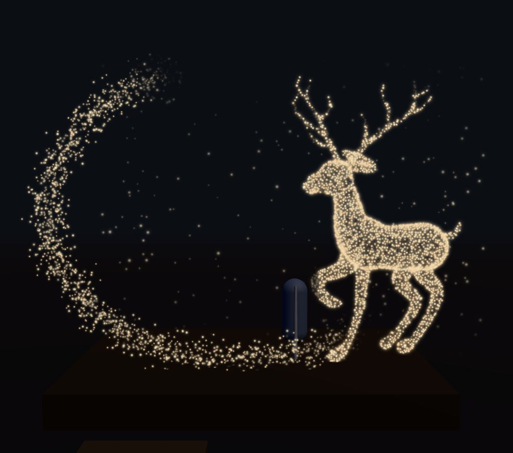
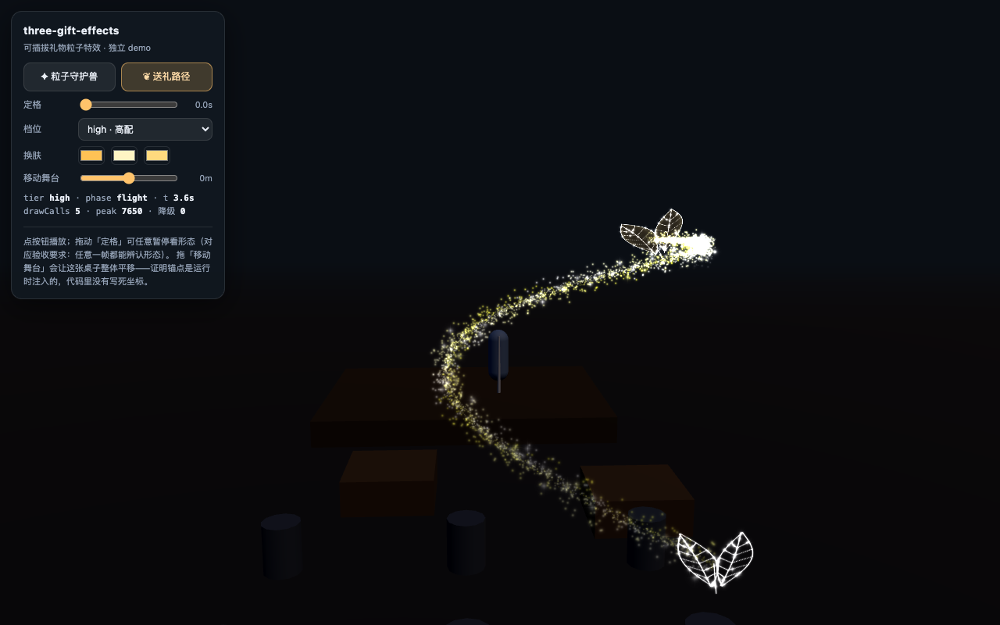

<div align="center">

# three-gift-effects: Pluggable Particle VFX for Three.js

**Miracle-Shen**<br>
*从「3D K 歌房」项目里抽出的独立版本 · 与宿主工程解耦*

<br>

[](https://miracle-shen.github.io/three-gift-effects/)
[](https://threejs.org/)
[](./LICENSE)
[](https://nodejs.org/)

**一组「粒子从起点飞出来、聚成一个能认出来的形态」的可插拔演出特效 —— 挂到任意 Three.js 场景就能用。**

*A drop-in particle VFX library for Three.js. You supply the anchors; it supplies the show.*

</div>

<div align="center">
  
  
  <br>
  <sub>两张都是 <code>examples/basic</code> 的实拍，不是渲染图：<code>npm run demo</code> 后点按钮 + 拖动「定格」即可复现。</sub>
</div>

## Abstract

> **three-gift-effects** sits at the intersection of real-time rendering and live-stage game feel. It packages the「粒子从起点飞出来、聚成一个能认出来的形态」family of gift VFX as a drop-in library for any Three.js scene.
>
> Most gift effects are welded to the scene that spawned them — hard-coded world coordinates, a specific GLB, a bespoke post-processing chain — and they consistently break the moment they are moved into a new room, a new camera rig, or a new renderer. This library removes that coupling by inverting it: **the host injects *anchors* (a stage bounding box, a performance point, a set of seat viewpoints) and nothing else**; the library owns every offset, particle budget, and shader, so the same effect reads correctly in a close-up mobile page and in a wide-shot concert hall.
>
> Two effects ship today — a **Particle Guardian (G05)** driven by a rigged low-poly mesh and surface point sampling, and a **1-to-1 Gift Path (G02)** built from a parametric flight curve plus a target point-cloud badge — both with three quality tiers, runtime re-skinning by key, and a `seek()` freeze API for frame-level acceptance testing.
>
> **中文摘要**：本库把「礼物粒子特效」做成可插拔组件。**唯一的场景耦合点是一个锚点对象**（舞台包围盒 / 表演点 / 观众席视点），由宿主算好注入；偏移量、粒子预算、GLSL 全部由库自己持有。因此换场景只改一组数，不需要重建场景、不需要美术资产、不需要动 shader。当前含两个效果：粒子守护兽（G05，驱动模型法）与一对一送礼路径（G02，参数化几何 + 目标点集法）。

## 📢 News

* **[2026-10-07]** 🚀 **three-gift-effects v0.1.0 正式开源**！两个可插拔礼物特效、三档粒子预算、零场景耦合。[[Live Demo](https://miracle-shen.github.io/three-gift-effects/)] [[Demo 源码](examples/basic/)]
* **[2026-10-07]** 🔧 修掉**送礼路径导致宿主整屏全黑**的问题（UnrealBloom + MSAA composer 下）。根因经验性定位，细节见 [已修：送礼路径会让宿主整屏变黑](#已修送礼路径会让宿主整屏变黑2026-10-07)。
* **[2026-10-07]** 📦 从星月林间 V33 抽出独立仓库，与宿主工程完全解耦。

## Playable Demos

<table align="center" width="100%">
  <tr>
    <td align="center" valign="top" width="50%">
      <p align="center"><b><font size="4">Particle Guardian · 粒子守护兽</font></b></p>
      <a href="https://miracle-shen.github.io/three-gift-effects/examples/basic/?effect=deer">
        
      </a>
      <div align="left" style="padding: 0 15px;">
        <p><b>Spec:</b> <i>"星光从四处飘来聚成一只半透明小鹿，沿台前巡行后散开。"</i></p>
        <p><b>Intro:</b> Surface point sampling on a rigged low-poly deer. Points converge in from the whole room, hold a readable silhouette while the bones drive a walk along the stage front, then dissolve.<br/>在半透明低模鹿上采样表面点云；星光从房间各处汇聚成形，骨骼驱动沿台前巡行，最后散开。</p>
        <p><b>How:</b> 驱动模型法 —— <code>低模鹿 + 6 根骨骼 + 表面采样点云</code>，几何在 <a href="./src/geometry.js">geometry.js</a> 里程序化生成。</p>
      </div>
      <p align="center">
        <a href="https://miracle-shen.github.io/three-gift-effects/examples/basic/?effect=deer"><b>▶&nbsp;&nbsp;Live Demo</b></a>
        &nbsp;&nbsp;·&nbsp;&nbsp;
        <a href="./src/effects/deer.js"><b>↓&nbsp;&nbsp;Source</b></a>
      </p>
    </td>
    <td align="center" valign="top" width="50%">
      <p align="center"><b><font size="4">1-to-1 Gift Path · 一对一送礼路径</font></b></p>
      <a href="https://miracle-shen.github.io/three-gift-effects/examples/basic/?effect=path">
        
      </a>
      <div align="left" style="padding: 0 15px;">
        <p><b>Spec:</b> <i>"暖金飞萤沿 S 形曲线飞过房间，在歌手肩侧绕成光环、凝结徽章。"</i></p>
        <p><b>Intro:</b> Warm fireflies travel an S-curve from a viewer's seat to the singer's shoulder, spiral into a halo, then crystallize into a laurel badge.<br/>暖金飞萤沿 S 形曲线从观众席飞向歌手肩侧，绕成光环后凝结成一枚叶片徽章。</p>
        <p><b>How:</b> 参数化几何法（曲线飞行）+ 目标点集法（徽章）—— 起点取「最靠镜头的座位」，终点按安全区偏移推算。</p>
      </div>
      <p align="center">
        <a href="https://miracle-shen.github.io/three-gift-effects/examples/basic/?effect=path"><b>▶&nbsp;&nbsp;Live Demo</b></a>
        &nbsp;&nbsp;·&nbsp;&nbsp;
        <a href="./src/effects/path.js"><b>↓&nbsp;&nbsp;Source</b></a>
      </p>
    </td>
  </tr>
</table>

**To run a demo locally:**

```bash
git clone https://github.com/Miracle-Shen/three-gift-effects.git
cd three-gift-effects
npm install          # 只装 three（peer dependency）
npm run demo         # 起服务并打开浏览器 → http://127.0.0.1:9100/
```

demo 是一个**不依赖任何外部素材**的最小场景（地面 + 舞台 + 一个歌手替身 + 两张桌子），用来证明本库不认识任何具体场景：

| 控件 | 验证的是什么 |
| --- | --- |
| **✦ 粒子守护兽 / ❦ 送礼路径** | 两个效果独立播放，互斥 |
| **定格**（拖动） | 任意一帧都能辨认形态 —— 需求文档 5.5 的验收要求 |
| **移动舞台**（拖动） | 整体平移舞台并**重新注入锚点** —— 代码里没有任何写死的世界坐标 |
| **换肤**（三个色块） | 颜色全部走 key，实时改色不需要动 shader |
| **档位**（high / mid / low） | 三档粒子预算的观感差异 |

## Effects

| 效果 | 编号 | 做法 | 观感 | 时长 |
| --- | --- | --- | --- | --- |
| **粒子守护兽** | G05 | 驱动模型法（低模 + 骨骼 + 表面采样点云） | 星光从四处飘来聚成一只半透明小鹿，沿台前巡行后散开 | 11.6s |
| **一对一送礼路径** | G02 | 参数化几何法（曲线飞行）+ 目标点集法（徽章） | 暖金飞萤沿 S 形曲线飞过房间，在歌手肩侧绕成光环、凝结徽章 | 9.4s |

新增效果（G04 / G07 / G09 / G12 / G15）只需实现同样的 `build` / `apply` 并登记进 `src/index.js` 的 `EFFECTS` 注册表。

## Installation

#### Prerequisites

```bash
# Node.js 18+（只用于跑 demo 与冒烟测试；库本身是纯 ESM，浏览器里可直接用）
node -v
```

#### From source

```bash
git clone https://github.com/Miracle-Shen/three-gift-effects.git
cd three-gift-effects
npm install          # 只装 three，库没有其它运行时依赖
```

本库是**源码分发**（尚未发布到 npm）：直接把 `src/` 拷进你的工程，或者用 `git submodule` / path alias 引。

> **three 是 peer dependency**（`>=0.160.0`）。库不会替你安装 three，也不会打包它 —— 你的工程用哪个版本，它就用哪个版本。demo 在没装依赖时会自动回落到 unpkg CDN 上的 `three@0.180.0`。

## Quick Start

#### 挂载到你的场景

```js
import * as THREE from 'three';
import { createGiftEffects } from './vendor/three-gift-effects/src/index.js';

const gifts = createGiftEffects(scene, { coarse: false, reduced: false });

// 1) 告诉它你的舞台在哪（这是唯一的场景耦合点）
gifts.setAnchors({
  stage: new THREE.Box3().setFromObject(stageMesh),   // 表演区包围盒
  mic: new THREE.Vector3(1.0, 1.8, 0),                // 表演点 / 歌手站位
  seats: [...].map((s) => ({ eye: s.eye.clone() })),  // 观众席锚点（可选）
});

// 2) 播放
gifts.trigger('giftDeer');   // 或 'giftPath'

// 3) 每帧更新（必须传相机与画布像素高，用来换算 px/米 → 决定光点屏幕尺寸）
function frame(dt) {
  gifts.update(dt, camera, renderer.domElement.height);
  renderer.render(scene, camera);
}

// 4) 卸载
gifts.dispose();
```

#### 锚点契约

库**不**自己去 `root.getObjectByName(...)` —— 不同工程的命名千奇百怪，硬找必然静默失配。所有定位量由宿主算好注入：

| 字段 | 类型 | 说明 |
| --- | --- | --- |
| `stage` | `THREE.Box3` | 表演区包围盒。只要 `max.y`（台面高度）和水平范围是对的即可 |
| `mic` | `THREE.Vector3` | 表演点。礼物终点、安全区都以它为基准推算 |
| `seats` | `Array<{eye}>` | 观众席视点。库会挑一个最靠镜头的当「送礼人」 |
| `layout` | `object` | 可选，覆盖 `GIFT_LAYOUT` 里的任意偏移量 |

偏移量（守护兽落在哪、终点抬多高、安全区多大）集中在 `src/config.js` 的 `GIFT_LAYOUT`，换场景只改这一组数，不需要碰 shader。

#### 皮肤包约定

颜色**不要**写死在 shader 里，全部用 key 暴露，由皮肤包覆盖：

```js
gifts.applySkin({
  'gift.particle.core.color':      [1.00, 0.47, 0.065],  // 守护兽主光点
  'gift.particle.highlight.color': [1.00, 0.91, 0.570],  // 守护兽高光
  'gift.path.core.color':          [1.00, 0.54, 0.090],  // 飞萤主色
  'gift.path.ring.color':          [1.00, 0.91, 0.550],  // 光环
  'gift.badge.leaf.color':         [1.00, 0.70, 0.210],  // 叶片徽章
  'gift.badge.vein.color':         [1.00, 0.96, 0.700],  // 叶脉
});
```

值一律是**线性空间**的 `[r,g,b]`（0~1），不是 sRGB 十六进制。从十六进制转换：

```js
const c = new THREE.Color('#ff7811');   // 自动按 sRGB 解释并转到线性工作空间
gifts.applySkin({ 'gift.path.core.color': [c.r, c.g, c.b] });
```

`applySkin` 只接受 `GIFT_SKIN` 里已存在的 key，写错 key 会被忽略而不是静默生效 —— 这是刻意的，防止换肤「看起来没反应」。

## API

| 方法 | 说明 |
| --- | --- |
| `setAnchors(input)` / `setStage(box)` | 注入/更新锚点。会保留当前播放进度重建，不跳帧 |
| `trigger(kind)` | 播放。两个礼物互斥，触发新的会先停旧的 |
| `seek(kind, seconds)` | **定格**到任意时刻（自动化验收用） |
| `resume()` / `stop()` | 继续 / 立即停止 |
| `setTier('high'\|'mid'\|'low')` | 切档位 |
| `degrade()` | 自动降一级，返回新档位（已在最低档返回 `false`） |
| `applySkin(patch)` | 换肤，只接受 `GIFT_SKIN` 里已存在的 key |
| `update(dt, camera, pixelHeight)` | 每帧调用 |
| `isActive(kind)` | 当前是否在播这个效果 |
| `stats` | `{tier, active, peak, drawCalls, age, duration, phase, progress, downgrades}` |
| `dispose()` | 释放全部几何与材质 |

## Configuration

全部可调项集中在 `src/config.js`，五个导出：

| 导出 | 作用 |
| --- | --- |
| `GIFT_DURATIONS` | 每个效果的播放时长（秒） |
| `GIFT_SKIN` | 皮肤包色板 —— 所有颜色 key 与默认值 |
| `GIFT_TUNING` | 全局观感开关（`glow` / `sceneGain` / `deerHeight` / `pointGain` / `noise` …） |
| `GIFT_LAYOUT` | 场景布局偏移 —— 全部相对锚点，不是绝对坐标 |
| `GIFT_TIERS` | 三档粒子预算 |

单位统一为**米**（与 three.js 世界单位一致）。

## Performance

三档预算（`src/config.js` 的 `GIFT_TIERS`）：

| 档位 | 守护兽（点云 + 柔光） | 送礼路径（飞萤 + 迸发） |
| --- | --- | --- |
| high | 14,500 + 2,600 | 4,200 + 1,600 |
| mid | 9,000 + 1,700 | 2,800 + 1,000 |
| low | 4,200 + 850 | 1,500 + 500 |

初始档位由 `createGiftEffects(scene, { coarse, reduced })` 决定：`reduced → low`、`coarse → mid`、否则 `high`；运行时可 `degrade()` 逐级降。

深度处理是**最高优先级**的红线（需求文档 4.1）：

- 所有材质 `depthTest: true` + `depthWrite: false`，粒子能被人物与家具正确遮挡，不会浮成一张贴片
- 严禁用 `ZTest Always` 解决穿透 —— 那会造成全屏覆盖与光污染，比原问题更严重
- 兜底：shader 里对「面部 + 麦克风」安全区做主动降亮（`uSafeCenter` / `uSafeHalf`）

#### Known Issues

- **Draw Call 超出规格上限**（规格：守护兽 ≤2、送礼路径 ≤3）：当前实测守护兽 **3**、送礼路径 **5**。原因是每个子部件都单独一个 draw call（柔光外壳、叶片网格、两处叶片描边各自一份）。修法是把同类型部件合并成单个几何 + `role` 属性分流，但会引入顶点着色器分支（规格 3.2 建议禁用动态分支），因此留到视觉改版时一起处理。
- **叶片徽章是亮描边的线稿感**，不是需求文档里那种「实心发光叶片」。想改成实心需要换材质混合方式（加性混合下任何重叠都会累加到白），属于观感决策，未动。
- **送礼路径没有「底光光带」了**（见下）。如果宿主后期链足够稳，可以把 ribbon 加回来 —— 但请先读下面这条。

#### 已修：送礼路径会让宿主整屏变黑（2026-10-07）

**现象**：在星月林间 V33（`UnrealBloomPass` + `MSAA` composer）里，只要送礼路径参与绘制，宿主每一帧的输出就是**纯黑**（实测整段播放期 ~0–7.9s 全黑，只有末期消散、透明度归零后才恢复）。同一场景里另外 5 个特效（含粒子守护兽）都正常。

**定位**：逐项二分（固定「一整段播放里每 0.85s 采一帧、必须帧帧正常」的判据）得到：

| 改动 | 结果 |
| --- | --- |
| 原样 | 帧帧全黑 |
| 隐藏 ribbon 光带 | 全部正常 |
| 隐藏叶片网格 | 全部正常 |
| 隐藏全部 Points（保留两个网格） | 全部正常 |
| `renderOrder` / `toneMapped` / `depthWrite` | **无效** |
| `uGlow` 降到 0.08 | **无效** |

即：**与亮度、混合、深度状态、渲染顺序都无关，只跟透明部件的绘制总量有关** —— 减掉任意一个重量级透明部件就恢复。`renderer.render()` 手动渲染（不经过后期链）始终正常，说明问题出在「透明叠加 → UnrealBloom 的 mip 链 → 输出」这一段的宿主侧鲁棒性上，本库能做的就是把叠加量降下来。

**处理**：删掉 ribbon。它在宿主的大远景里是 0.033 视空间单位的细线（<1px，肉眼不可见），在 demo 里则表现为两条突兀的白色导轨 —— 删掉它既修了黑屏，观感也更干净。删除后连续 3 次完整播放 + 粒子守护兽均全帧正常。

> ⚠️ **这个修复是经验性的，机制没有完全定位**：如果你的宿主也用 UnrealBloom + MSAA composer，建议接入后跑一遍「完整播放 + 逐帧截图」的验收，而不是只看首帧。

## Project Structure

```
src/
  index.js          入口：createGiftEffects + API + 效果注册表
  config.js         全部可调项（色板 / 预算 / 布局偏移）
  anchors.js        锚点解析 —— 唯一的场景耦合点
  shaders.js        全部 GLSL
  geometry.js       程序化几何：低模鹿 / 种子点云 / 叶片 / 飞行曲线
  effects/
    deer.js         CASE A 粒子守护兽（含骨骼动画）
    path.js         CASE B 一对一送礼路径
test/smoke.mjs      不需要 WebGL 的冒烟测试
examples/basic/     最小可运行 demo（GitHub Pages 上跑的就是它）
scripts/serve.mjs   本地 demo 用的静态服务器
```

## Acknowledgments

three-gift-effects builds on the excellent open-source work of:

- **[three.js](https://github.com/mrdoob/three.js)** — 渲染基座，本库的全部几何、材质、骨骼都跑在它上面
- **[OrbitControls](https://github.com/mrdoob/three.js/blob/dev/examples/jsm/controls/OrbitControls.js)** — demo 的相机控制
- **[unpkg](https://unpkg.com/)** — 未装依赖时 demo 的 three 来源
- 设计依据：**《3D K 歌房 · 礼物粒子特效实现需求说明》v1.0**

## License

MIT — 见 [LICENSE](./LICENSE)。
